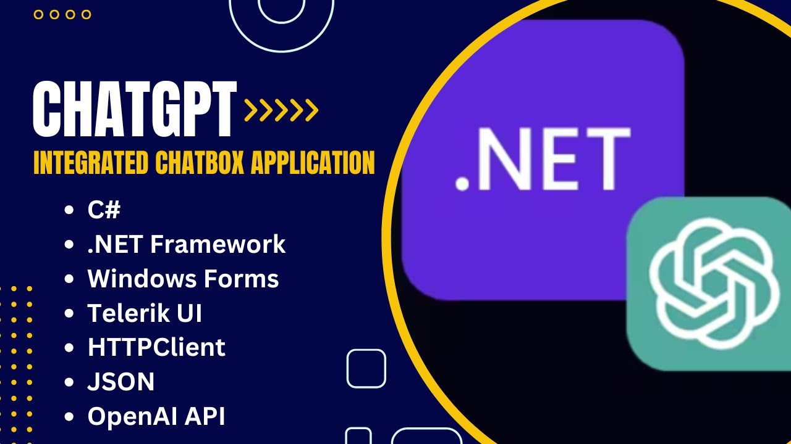

# ChatGPT-Integrated Chatbox Application
## Demo Video

## Description
Developed a Windows Forms application using C# and Telerik UI that integrates with OpenAI's ChatGPT API to create an interactive chatbox. 
The application includes the following features:
- Real-time conversation with ChatGPT, maintaining the entire chat history to provide context-aware responses.
- Interactive UI elements with Telerik's RadChat component.
- Suggested actions to enhance user engagement and interaction.
- Proper handling of HTTP requests and JSON responses using HttpClient and Newtonsoft.Json.
- Custom event handling and form controls for an improved user experience.
- Available in two different version: Dark and Light.

## Key Technologies
- C#
- .NET Framework
- Windows Forms
- Telerik UI
- HTTPClient
- JSON
- OpenAI API

## Installation
### Download Files
In the repository, you will find two folders for the different themes:

- **Dark Theme**: `Dark Theme`
  - `setup.exe`
  - `GPT Chatbox.msi`
- **Light Theme**: `Light Theme`
  - `setup.exe`
  - `GPT Chatbox.msi`

### Steps to Install
1. **Choose a Theme**: Navigate to either the `Dark Theme` or `Light Theme` folder.
2. **Run the Installer**: You can install the application using either `setup.exe` or `GPT Chatbox.msi`.
   - Double-click `setup.exe` and follow the installation prompts.
   - OR
   - Double-click `GPT Chatbox.msi` and follow the installation prompts.
3. **Launch the Application**: After installation, you can launch the ChatGPT-Integrated Chatbox Application from your desktop or start menu.

## Usage
1. Run the application.
2. When running the application, you need an API Key from OpenAI. Make sure you have an OpenAI API key.
3. Interact with the chatbox by sending messages.

## Screenshots
- Screenshot 1: Dark Theme 1
- Screenshot 2: Dark Theme 2
- Screenshot 3: Light Theme 1
- Screenshot 4: Light Theme 2

## Demo Video
- Demo Dark Theme 
- Demo Light Theme

